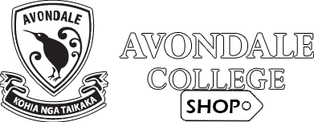
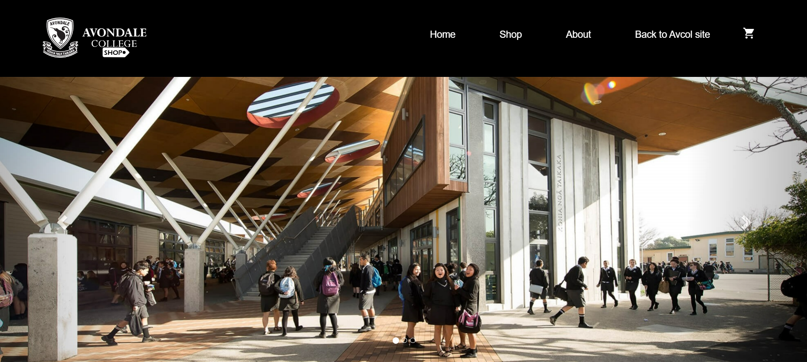

 

  

  <h3 align="center">Avondale College Uniform Shop (UniS)</h3>

  

    A Student built uniform shop that aims to be functional and aesthetically pleasing 
     
     
    <a href="https://github.com/ac111532/UniS/issues">Report Bug</a>
    .
    <a href="https://github.com/ac111532/UniS/issues">Request Feature</a>
  

   

## About The Project

I have been tasked with creating a website for the Avondale College shop because they do not currently have a website, and it would be of great service to the school if they had one. I need to make a website that is able to be accessed by possibly hundreds each day, and that is easy to use by the general public as it’d be a first glance of the schools uniform which is an important image.

Currently the college has a small blurb on their main website that’s hidden inside a bunch of submenus, that only say “We have a uniform shop, here’s when its open, you need to come and visit to see any of the products and prices we have.” That’s not very user friendly, so I wanted to change this and make it as nice as possible to use. Ideally by the end of this, I’ll have a site that gives the customer the ability to place orders to be picked up, and possibly even a way to pay for it online too.

## Built With

ASP.NET Core

## Getting Started

Below are instructions for getting a local version of the shop to run for debugging.

### Installation

1. Download Zip file
2. Open file in Visual Studio (2022+ recommended)
3. Run the command "update-database" in the NuGet Package Manager Console
5. Run/Debug to start localhost site.

## Roadmap

https://trello.com/b/HS6TA96C/unis-development

## License

Copyright (C) Ethan Blanch - All Rights Reserved.

The receipt or possession of the source code and/or any parts thereof does not convey or imply any right to use them
for any purpose other than the purpose for which they were provided to you.

The above copyright notice and this permission notice shall be included in all copies or substantial portions of the Software.

## Authors

* **Ethan Blanch** - *Student* - [Ethan Blanch](https://github.com/ac111532) - *Project Dev*

